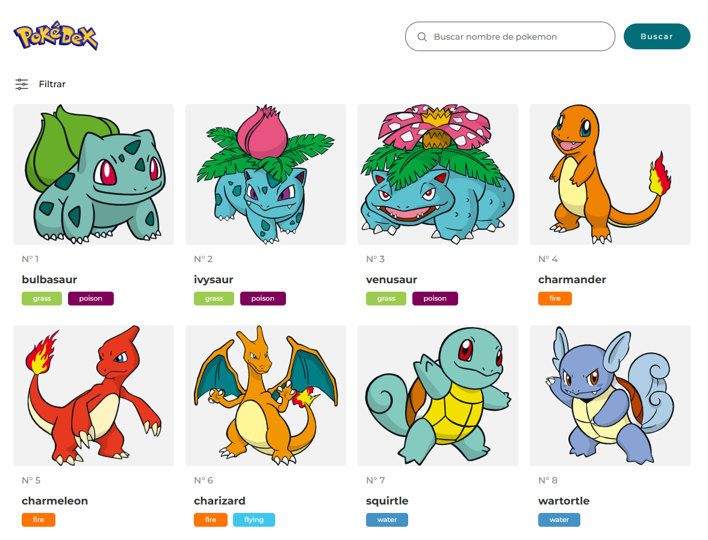
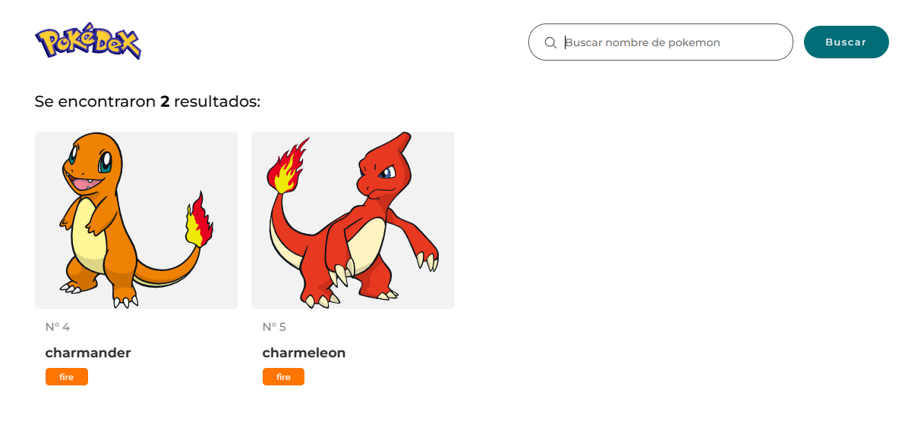
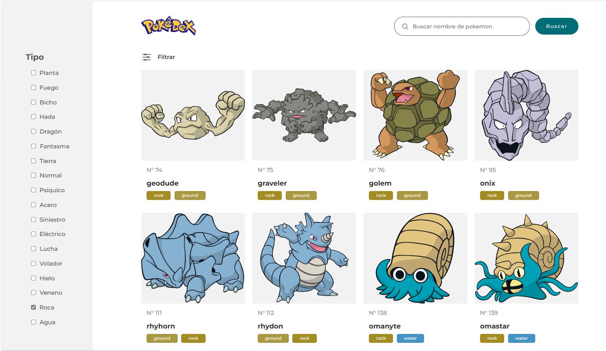

# API Pokedex 

Ejercicio para practicar react con Hooks (useState, useEffect, useContext) donde se ha utilizado la APi de PokeApi y como guia se ha utilizado el [video](https://www.youtube.com/watch?v=BVQrG-Bp-94&t=5444s) de youtube del canal - Programación para el Mundo-.  
Esta es la API que se ha utilizado para el ejercicio que es la <a href="https://pokeapi.co/">PokeApi.</a>

El objetivo es utilizar los Hooks de react mencionados anteriormente, para realizar un filtro por Tipo de Pokemon, o hacer una búsqueda en la 🔎, de un pokemon especifico por nombre, y al presionar el boton de buscar, nos devuelve un resultado.  

Tambien podemos filtrar por tipo de Pokemon, y luego marcar la característica que queremos que nos filtre.
 

## Tabla de Contenidos

- [Instalación](#instalación)
- [Uso](#uso)
- [Contribución](#contribución)
- [Licencia](#licencia)

## Instalación

No es necesaria ninguna instalación, es un aplicativo web al que se accede con un navegador.
Tambien se puede ver desde <a href="https://apipokemon-react-ejercicio.netlify.app/"> netlify.</a> 

## Uso

No se precisa identificarse para navegar para ver los diferentes pokemons y su informacion, asi como realizar filtros o busquedas de los mismos. 
El código del proyecto está disponible para su descarga en el enlace de código, y al descargar el zip debeís en terminal descargar npm para que funcione en vuestro ordenador.

## Desarrolladores:

> <a href="https://www.linkedin.com/in/mar-prieto-garcia/">- María del Mar Prieto Garcia</a>

## Tecnologías utilizadas

 
   

## React + Vite

This template provides a minimal setup to get React working in Vite with HMR and some ESLint rules.

Currently, two official plugins are available:

- [@vitejs/plugin-react](https://github.com/vitejs/vite-plugin-react/blob/main/packages/plugin-react/README.md) uses [Babel](https://babeljs.io/) for Fast Refresh
- [@vitejs/plugin-react-swc](https://github.com/vitejs/vite-plugin-react-swc) uses [SWC](https://swc.rs/) for Fast Refresh

## Licencia

Este proyecto está bajo la Licencia [CCO](LICENSE).
